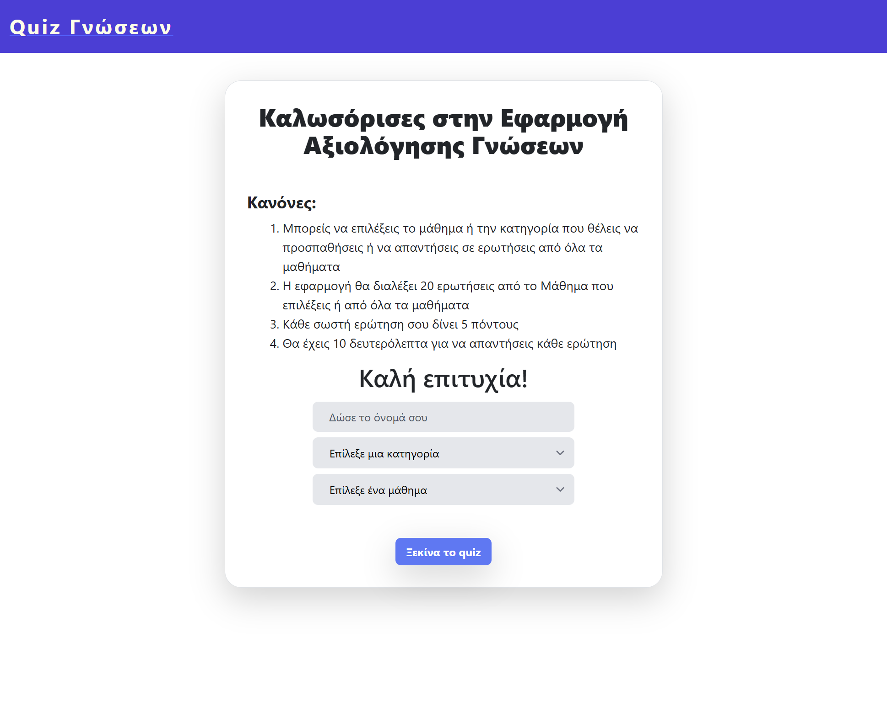

# QuizApp

The frontend is based on [Angular CLI](https://github.com/angular/angular-cli)

## Development server

Run `ng serve` for a dev server. Navigate to `http://localhost:4200/`. The app will automatically reload if you change any of the source files.

## Build

Run `ng build` to build the project. The build artifacts will be stored in the `dist/` directory.

## nginx

The app images are served by nginx (port 8080)

## docker

App is mapped with docker to port 80
